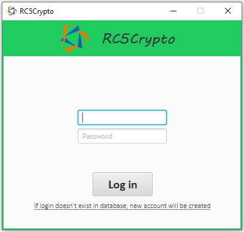
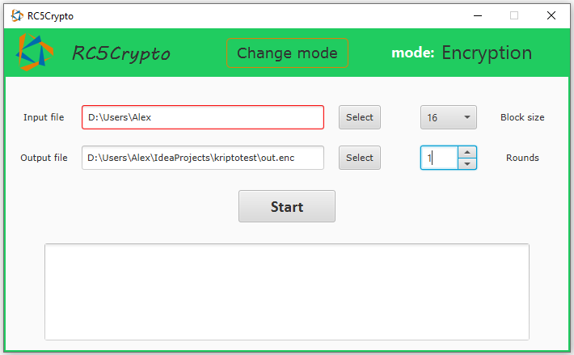

## Актуальная версия СКЗИ 
 Ветка **master**.
 
 Текущая стадия: main.GUI приложение.

## Используемые библиотеки:
* javafx;
* jcommander;
* com.google.common;

## Окно авторизации:

## Окно шифрования:

## Пример работы на видео:

